# Resturant App 🍔🍕🍹
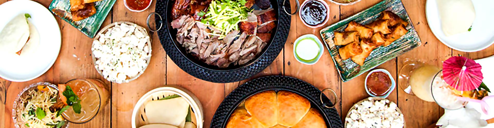

### 1. Overview 📖
Resturant app provides users the ability to browse menu right through their phones !.\
Data of the resturant was stored in an external file `resturant_data.dart` for better access and code readability.

### 2. Widgets Used 🎨
Two types of widgets were used in this application :
##### 2.1 Built-in widgets
These widgets are included in flutter and ready to use. Among many built-in widgets we should use the most useful ones, I used the following widgets :
###### 2.1.1 AppBar
`AppBar` widget was used to build the app bar which contains only a title `Menu`. See Image (1).

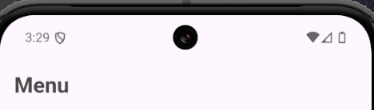

Image (1) : AppBar widget result.

###### 2.1.2 TabBar
`TabBar` widget enables the user to **switch** page content based on selection. In order to implement this widget and use it, it must be linked with a `TabBarView` widget under the `DefaultTabController` which must specify `length` as the number of contents to be shown. See Image (2).

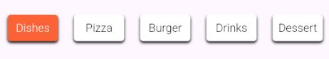

Image (2) : TabBar widget result

###### 2.1.3 TabBarView
`TabBarView` widget represents the shown content to user after **tabbing** on one of the tabs defined in `TabBar`. See Image (3).

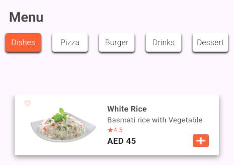

Image (3) : TabBarView widget result

###### 2.1.4 ListView
`ListView` was used in this app to view food items, since food items differ from time to time, and from section to section, I built a `ListView` which iterates through the `menu` list which is a list of lists. It will be useful if we have more than one food item per section. See Image (4).

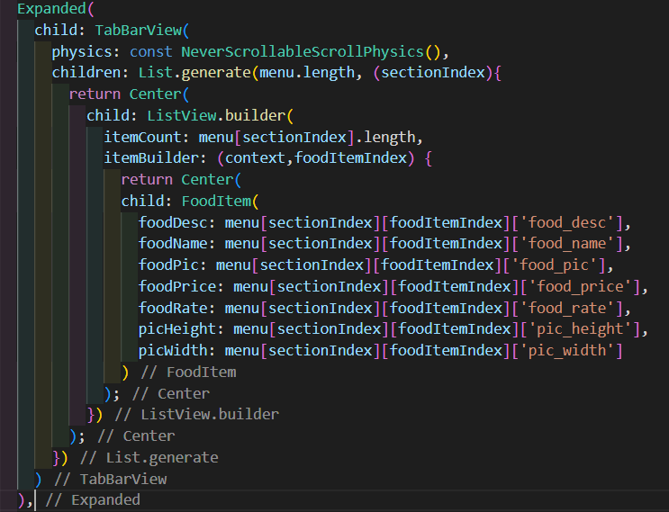

Image (4) : list view code snippit

###### 2.1.5 AlertDialog
`AlertDialog` is the widget that appears as a simple message to user with some buttons to take an action, agree or reject for example. See Image (5).

This widget should be the returned widget from the `showDialog` function.

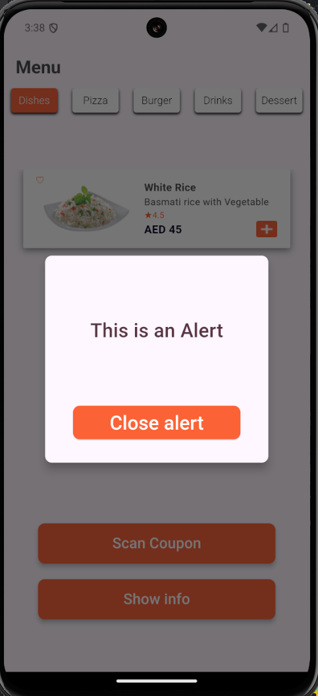
Image (5) : AlertDialog widget results

##### 2.2 Custom widgets
This type of widgets is usually repeated in code and takes a lot of lines to build it. In order to enhance code quality and readability, These widgets got separated and isolated in a file and called whenever they are useful. I used the following custom widgets :
 
###### 2.2.1 FoodItem
`FoodItem` widget represents a single food item in a single section. Obviously, this code will get repeated each time a food item is added to the menu. In order to prevent code repetition and enhance code, `FoodItem` was created. See Image (6).

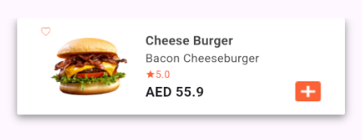

Image (6) : FoodItem widget result

###### 2.2.2 Section
`Section` widget represents menu items or "What are the types of food this resturant can provide to me". See Image (7).

Image (7) : Section widget result

### 3. Results ⭐
Here are the results 🥳
##### 3.1 as screenshots

**Dishes Section**
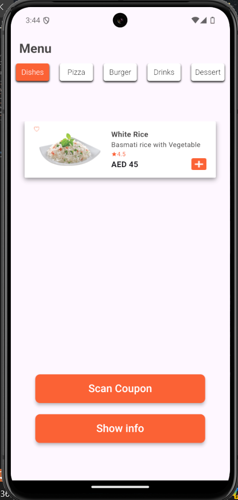

**Pizza Section**
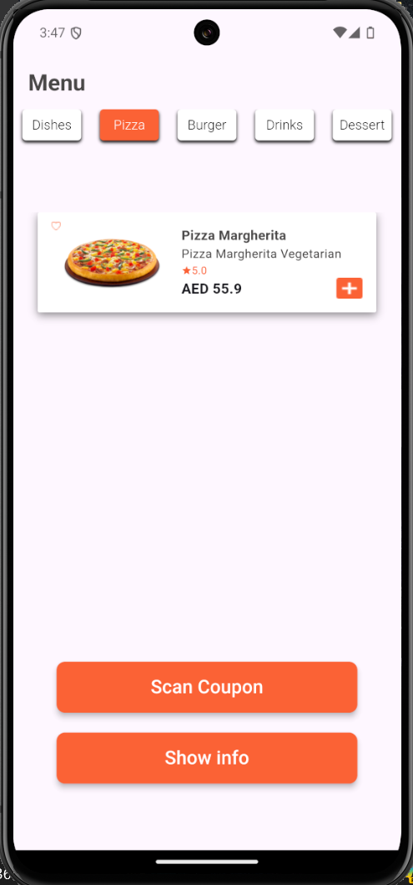

**Burger Section**
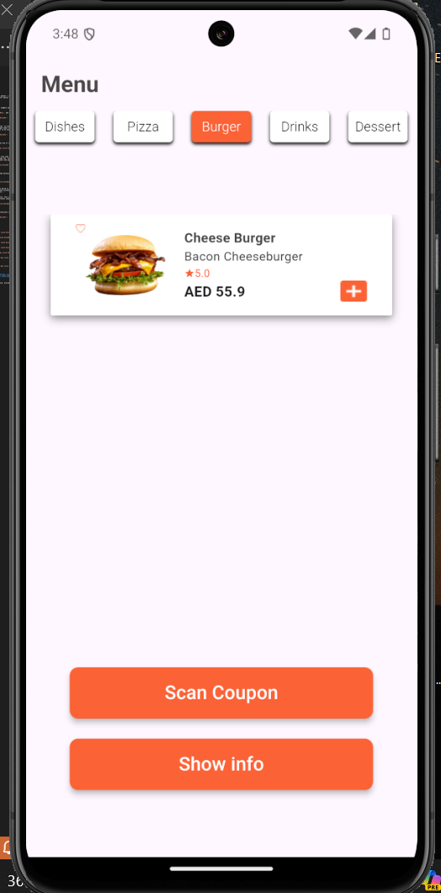

**Drinks Section**
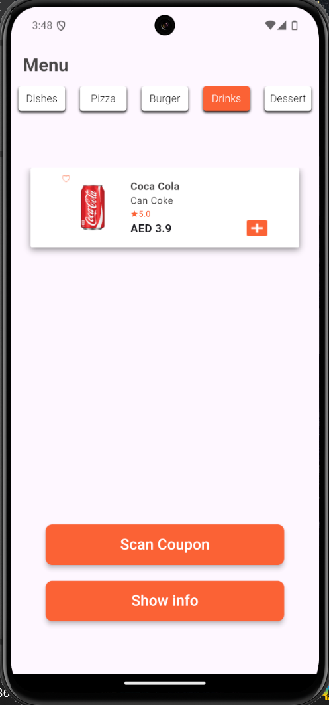

**Dessert Section**
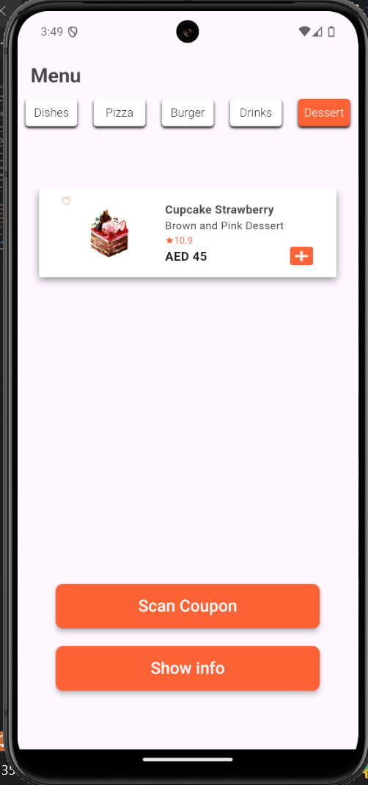

**Bottom Sheet**
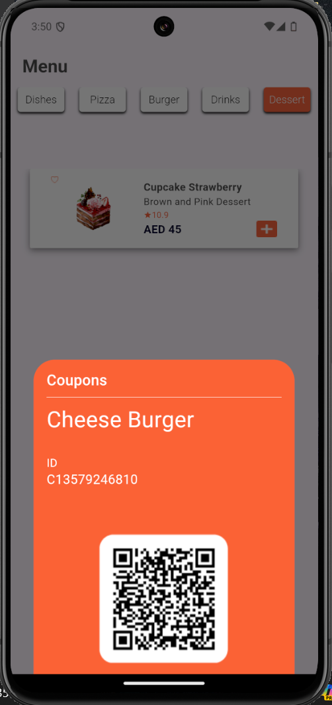

**Alert Dialog**
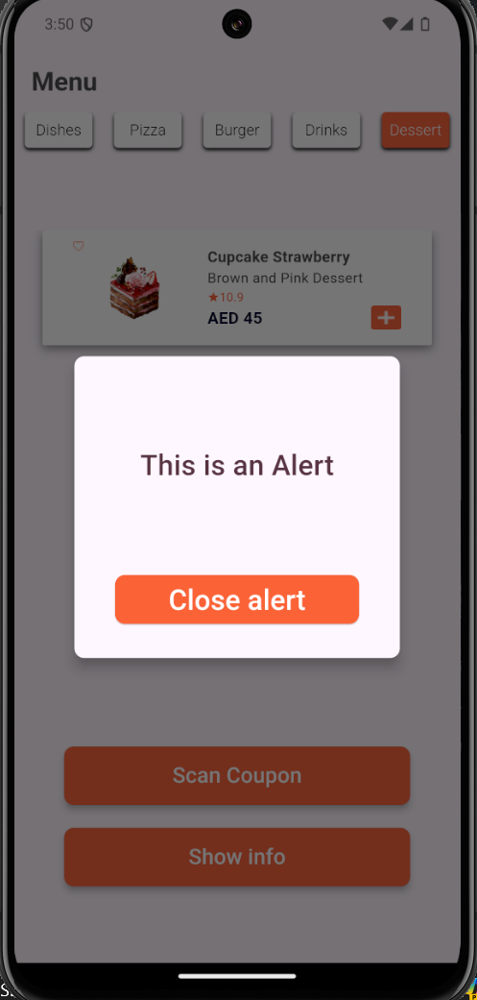

##### 3.2 as video
<video controls src="readme_media/results.mp4" title="results"></video>

##### N O T E : some differences in colors between design and code may be noticed, this is due to my device color system. I must assure you that I used the same colors specified in figma 😅

### 4. Conclusion 🏁
TabBarView and bottom sheet are very powerful tools to improve user expierence, providing them many options and styles to view content.

**Author : Yaser Alkhayyat**