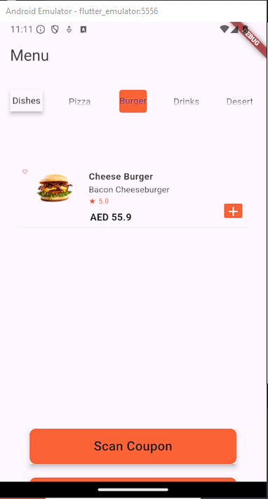
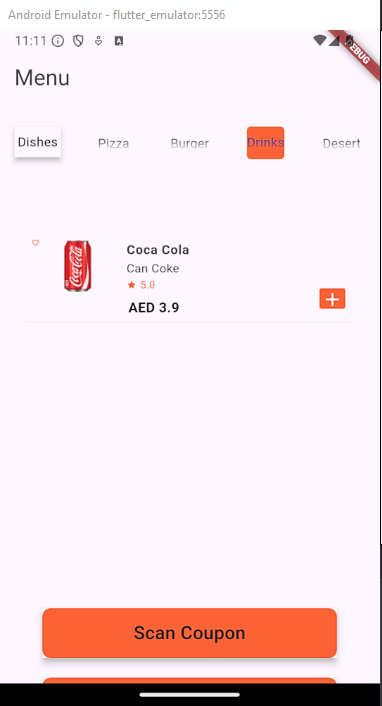
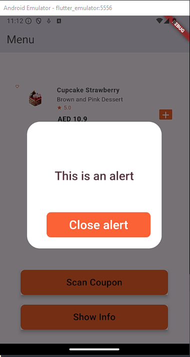

# My Food Ordering App

# Description:

This Flutter application is a basic food ordering app. Users can browse through different food categories, view item details, and add items to their cart. (Functionalities still on progres..)

# Widgets Used:

<ul>
<li>Core widgets: Scaffold, AppBar, Text, ElevatedButton, Image, Icon, ListTile
</li>
<li>Layout widgets: Column, Row, Expanded, Container
</li>
<li>Navigation: Navigator, MaterialPageRoute
</li>
<li>State management: StatefulWidget, State
</li>
<li>Other: GridView, CircularProgressIndicator
</li>
</ul>

# Key functionalities:

<ul>
<li>Displaying a list of food categories.
</li>
<li>Navigating to item details page on category tap.
</li>
<li>Adding items to the cart.
</li>
<li>Viewing the cart contents.
</li>
</ul>

# Note:

Stack widget could be used for more complex layouts or overlays.

# 1

# 2

# 3

# 4

# 5

# 6

# 7

# Important

I spent few hours trying to figure out how to change the indicator background color when clicking an item without losing it's elevation effect. and i couldn't get it. I could do it with onTap function inside the TabBar hence changing background color of the clicked item . but i spared myself the hussle because i'm pretty sure tabBar has a function for that specifically.
I hope you understand :)
