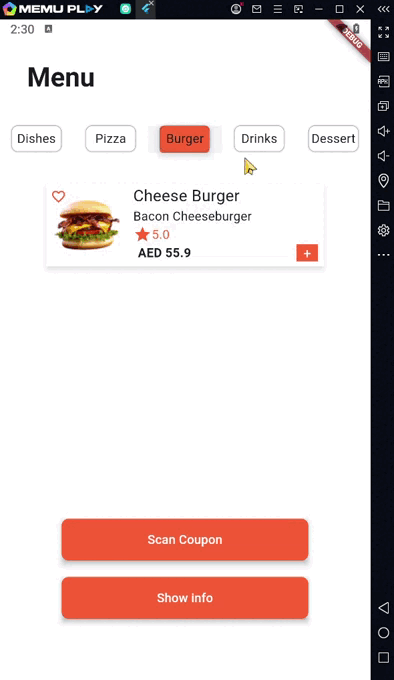

# Restaurant Menu app

this project is to display Menu for foods there's TabBar of Food if Clicked will show the info of it

Functionalities:
<li>Displays a tab bar at the top with five categories (Dishes, Pizza, Burger, Drinks, Dessert). 

<li>Shows a sample food item with an image, title, description, rating, and price.

**Widget that i learn:**
#### ShowDailog
#### TabBar
#### TabBarView
#### Material
