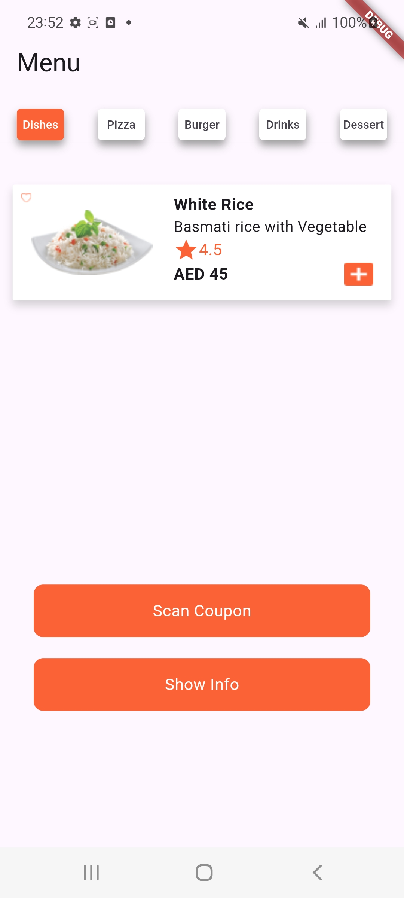
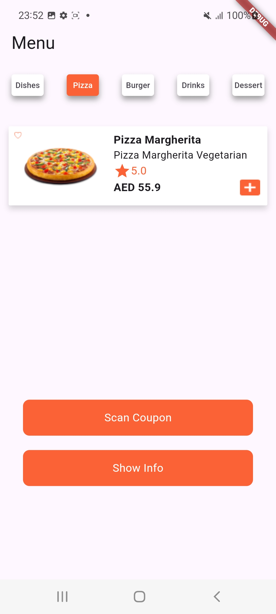
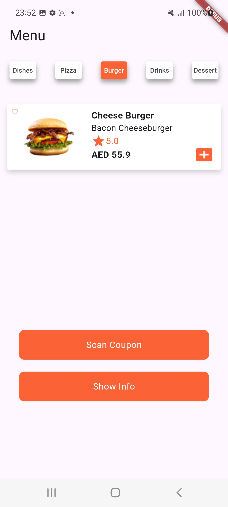
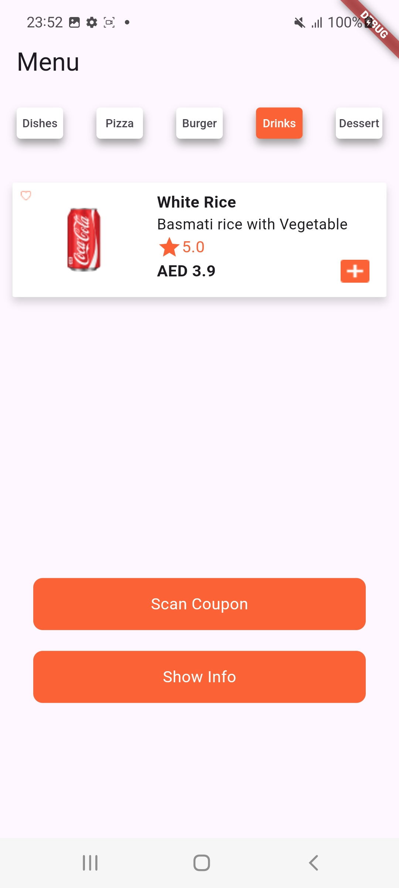
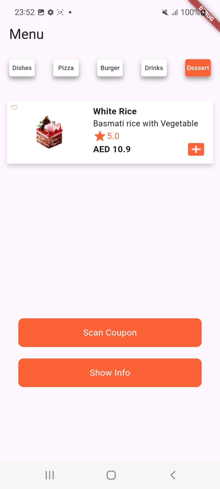
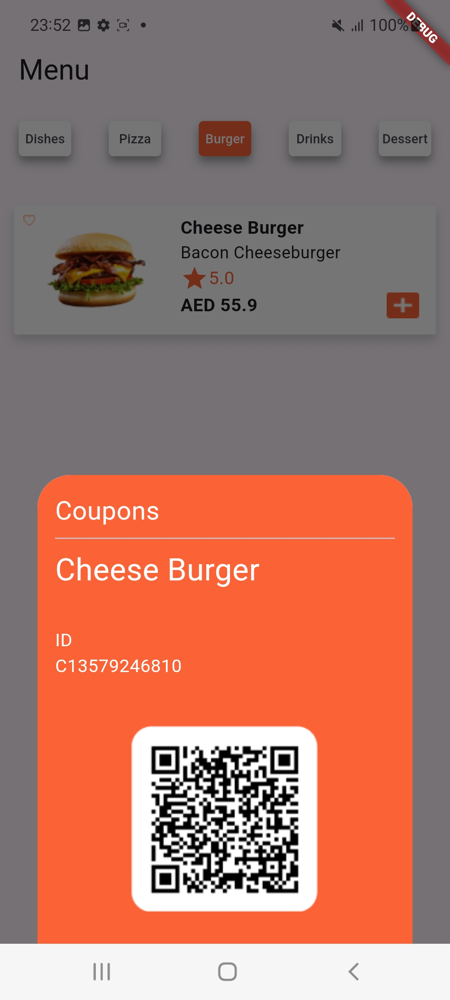
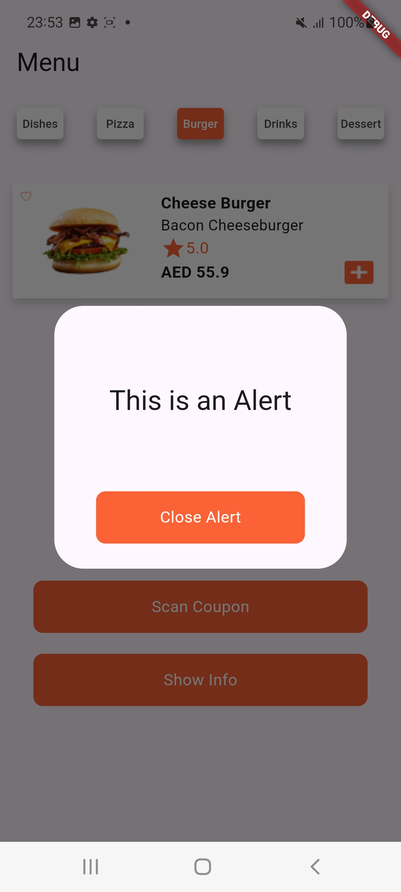

# Menu App

A Flutter application that showcases a menu with a customizable tab bar and interactive components. This app features a custom tab bar with shadow effects, and interactive UI elements like buttons and dialogs.

## Features

- **Custom Tab Bar**: A `TabBar` with customized containers as tabs, featuring dynamic styling based on selection.
- **Modal Bottom Sheet**: Displays a coupon section with details and an image.
- **Alert Dialog**: Shows a simple alert dialog with a close button.

## Getting Started

To run this project, you'll need to have Flutter installed on your machine. If you haven't set up Flutter yet, follow the instructions on the [official Flutter installation guide](https://flutter.dev/docs/get-started/install).

### Installation

1. **Clone the Repository**

   ```bash
   git clone https://github.com/turki-aloufi/Restaurant-Menu-app.git
   cd your-repository
   ```

2. **Install Dependencies**

   ```bash
   flutter pub get
   ```

3. **Run the App**

   ```bash
   flutter run
   ```

## Usage

### Custom Tab Bar

The `TabBar` in the `Menu` class uses `TabController` to manage the state of tabs. The `_buildTab` method creates tabs with shadows and dynamic styling based on their selection state.

### Modal Bottom Sheet

The app includes a button that triggers a modal bottom sheet to display coupon information.

### Alert Dialog

A button triggers an alert dialog to show a simple message with a close button.

## Code Structure

- `Menu` (Stateful Widget): The main widget that contains the `TabBar`, buttons, and modal dialog.
- `MenuStatus` (State Class): Manages the state of the `Menu` widget, including the `TabController` and UI interactions.
- `_buildTab`: A helper method to create styled tabs for the `TabBar`.

## Screenshots

- Dishes
  
  

- Pizza
  
  

- Burger
  
  

- Drinks
  
  

- Dessert
  
  

  - bottom sheet
  
  

  - alert
  
  


## Screen Recording

<video controls src="assets/readme_assets/Screen_Recording_20240819-232041.mp4" width="300" height="700">
