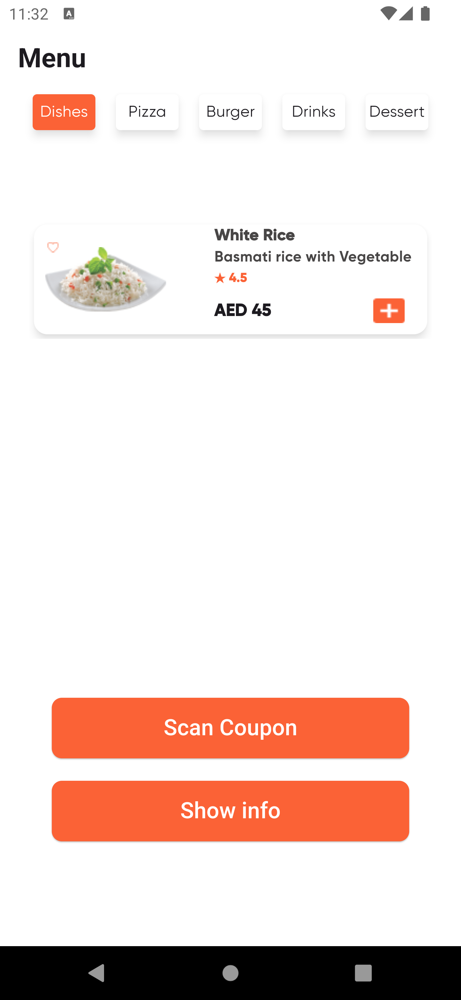
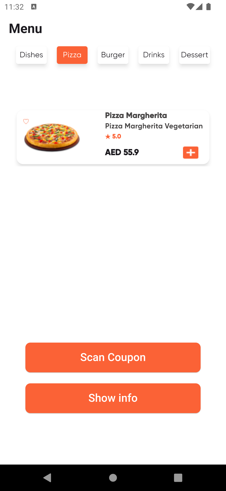
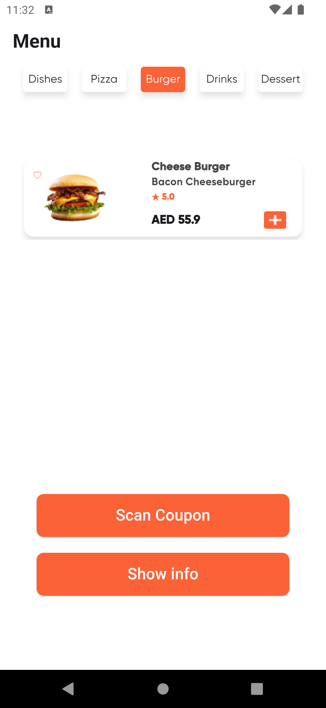
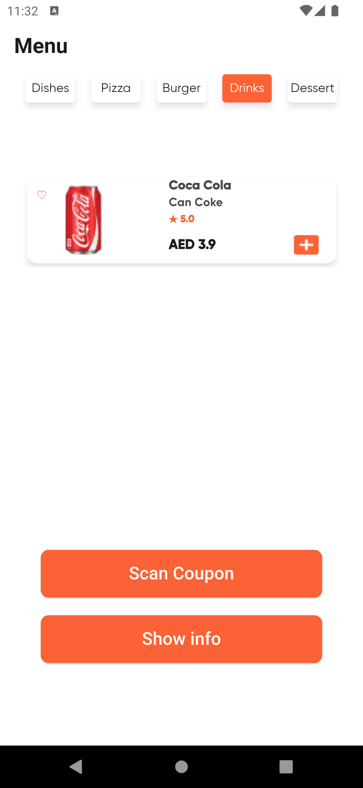
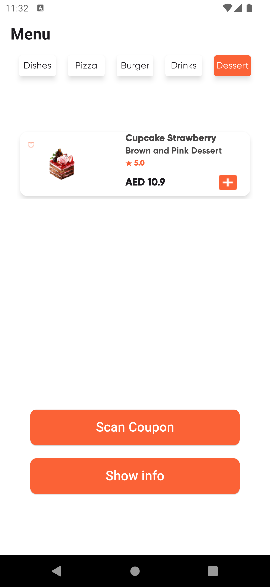
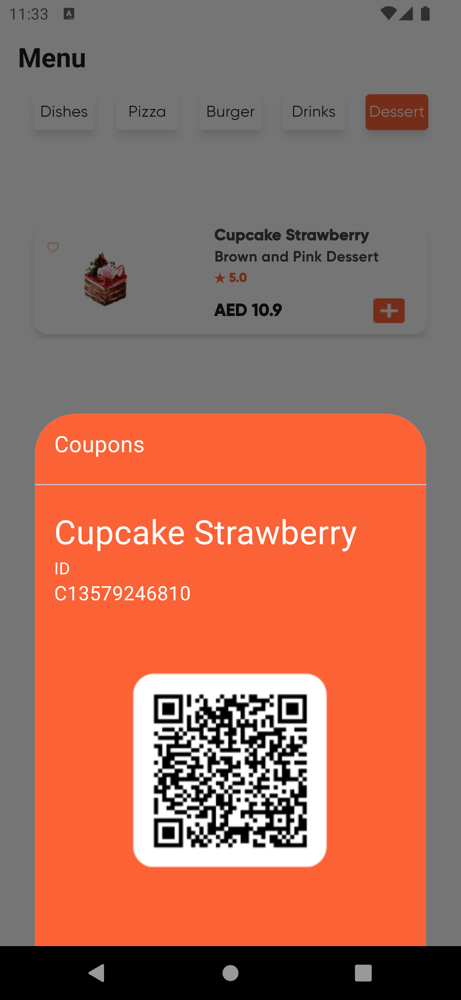
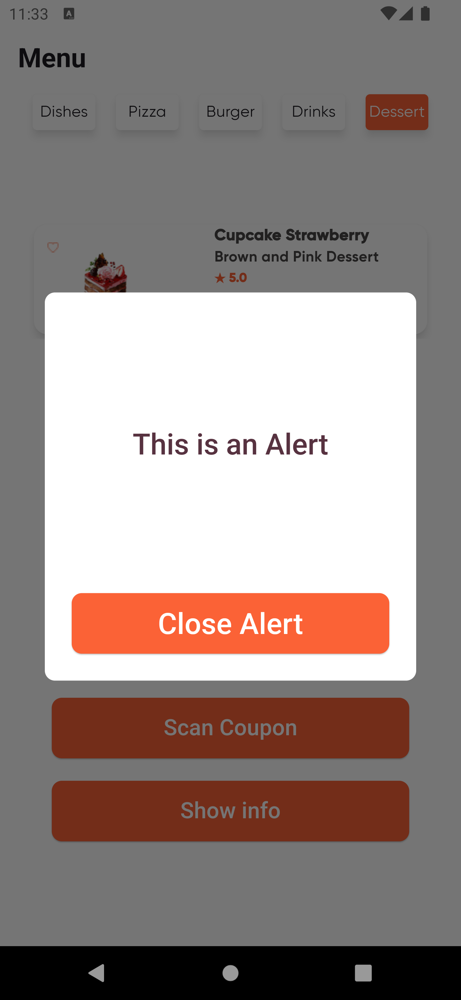

# Restaurant Menu App

A simple flutter project showing the UI implementation of a restuarant menu app where users can display available foods and get coupons.

## Description

The restaurant menu app is well designed to offer a great user experience, its simple UI is easy to use and understand while displaying all the details the user needs in a menu.

## Work

- Widgets were separated in dart files for easier maintenance and readability.
- Used a list of map to store available items to pass to widgets.
- Used conditional statements to change the color of tabs in TabBar 
- Widgets used: (TabBar, TabBarViewPadding, AlertDialouge, showModalBottomSheet method, SizedBox, Container, Column, Row, Stack, Card, Expanded, Text, Center, Align, InkWell, Divider, Image and many more).
- Wrapped Tabs in TabBar in Card widget to fix the issue of shadow.

- Future Work:

*When user clicks the add button, a FoodCard is displayed under the one already present, and incrementing a counter placed at the buttom next to the total price*

## UI

- Note: A video of UI is uploaded in assets/video

**Home Screen**

**Bottom Dialouge**

**Alert Dialouge**

## Help
If you encounter any issues:
- Make sure you have all the necessary dart files within the project
- Contact us so that we can help resolve the problem

## Authors
Abdulaziz Alamri

## Version History
**See commits history for more details**

## Acknowledgments
Tuwaiq Academy

