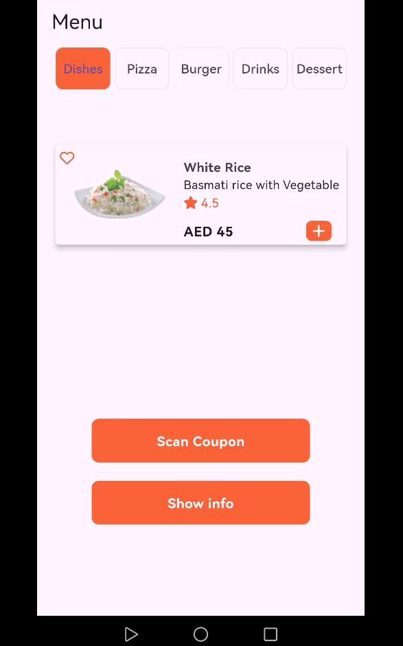
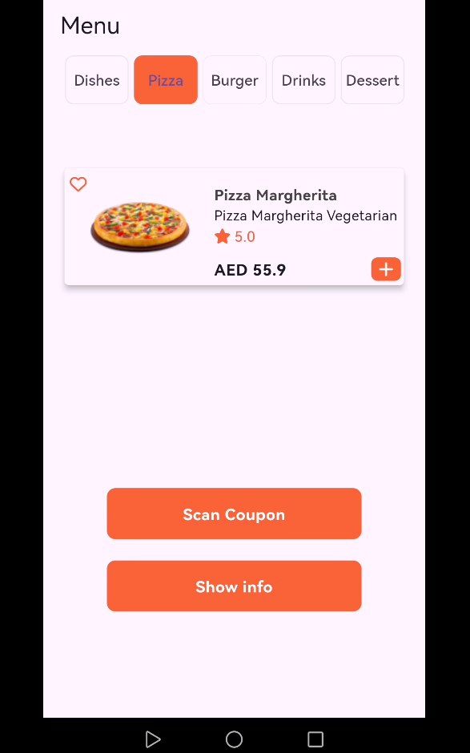
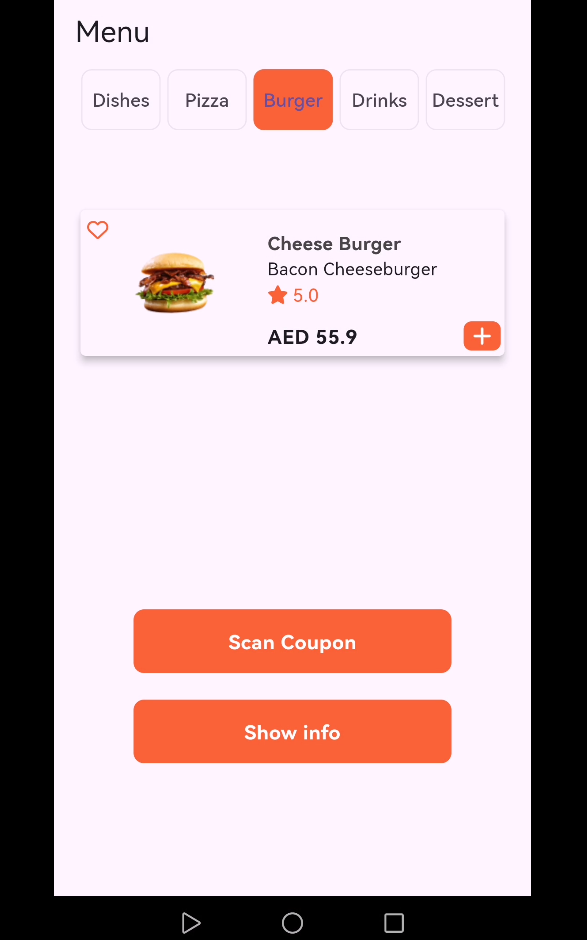
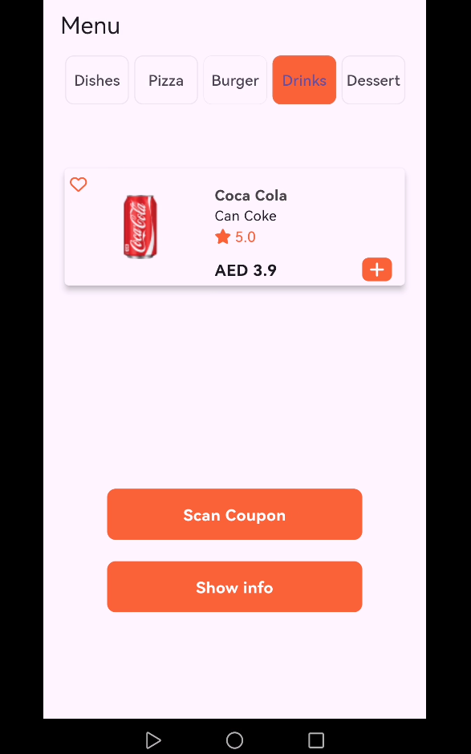
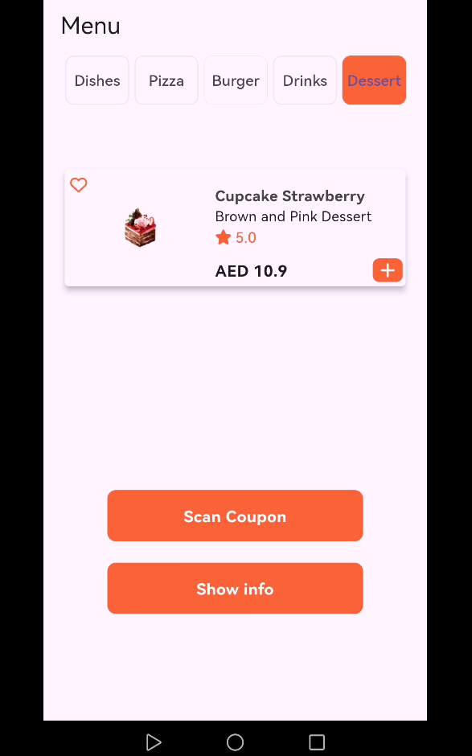
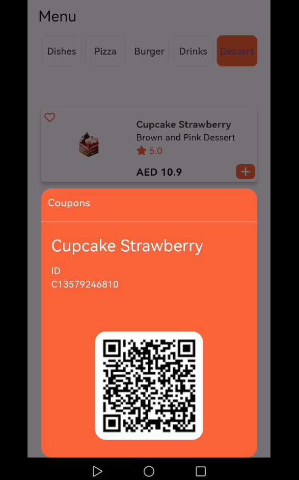
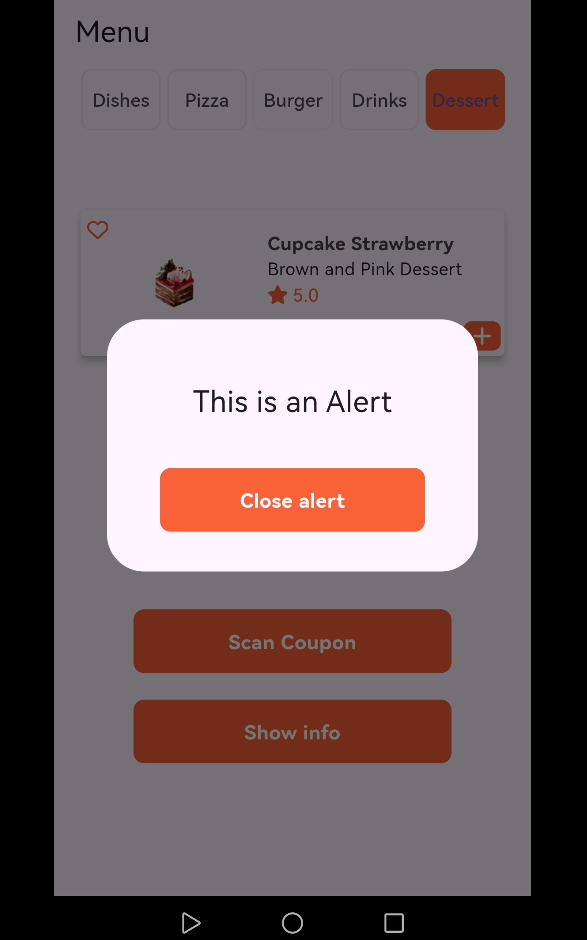

# Restaurant-Menu-app

### HomePage

this page have all app tab and widget form it we can go to any tab this the method and widget that has been used

- DefaultTabController() : will give TabBar widget the Controller that is need 

-TabBar() : here we can ready the tabs of the app and chnge it indicator and label tabs

- TabBarView() : from here will give contant of each tab 

---

### TabContant widget

custum widget that will take model to show difrent data for each tab this widget been used with it

- cloum is layout

- Container for showing the food card
  
  - Material() : is used to give shadow to the Container with out using boxShadow

- the foodModel give some of it is data to the food card

- SizedBox and Padding : for handle widget layout in  the cloum widget

- Spacer to push betwen  widgets  

- ButtonWidget() : simple custum widget that create with Container and GestureDetector to handle user click

   - it will also take void VoidCallback to show alertdialog or  bottom sheet

- DiologWidget() : will show up alertdialog that only have content in it there is Column
widget that show text and button

-  SheetContiner() : will show up bottom sheet and it will take foodModel to show the name of the food 

---

### img of the  Restaurant-Menu-app

   

