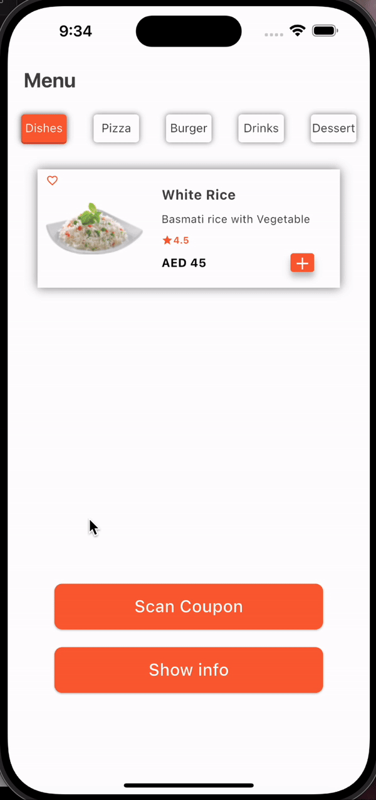

<p align="center">

<br/>

# Restaurant Menu app

 Developing an application for Flutter that has an Alert dialog, Bottom Sheet, and TabBar

## Requirements

 In order to run the application, this project requires a Dart SDK, Flutter SDK and a command line interface (CML).

## install dart SDK
 install dart SDK from [dart documentation](https://dart.dev/get-dart)

 ## install flutter SDK
 install or upgrade the latest version of Flutter from these installation [guides](https://docs.flutter.dev/get-started/install)

## How to run the project

1. Open terminal or CMD.
2. Navigate to the project path, such as 
```bash
cd /Users/amjadelahi/flutter_bootcamp/Restaurant-Menu-app/restaurent_menu_app
```
 3. Run the application with a command: 
```bash
flutter run
```
 ## Widgets 
The widgets that are used:

| Widget | Description |
| --- | --- |
| Scaffold | Used to construct the fundamental visual layout structure of the material design |
| SafeArea | Is the area of the screen that will always be displayed and free of system UI elements |
| Column | Presents the components in a vertical array |
| Text | Displaying and styling text |
| SizedBox | Provide some distance between the two widgets, place an empty Sized Box between them |
| Container | Similar to a box used to store things |
| Padding | Add space around widget |
| Row | Presents the components in a horizental array |
| ElevatedButton | Is a label that, when clicked, takes you to a different screen |
| showBottomSheet | A type of modal that appears at the bottom of the screen and is frequently used to show more options or actions |
| Divider | Used to create a horizontal line that separates content |
| AlertDialog | Used to display important information, warnings, or prompts to users |
| FloatingActionButton | Used for a primary action in the app, such as adding a new item, composing a message |
| TabBar | Mainly used for mobile navigation |
## Output 

<p align="center">

<br/>


## created by
Amjad Noor Elahi

