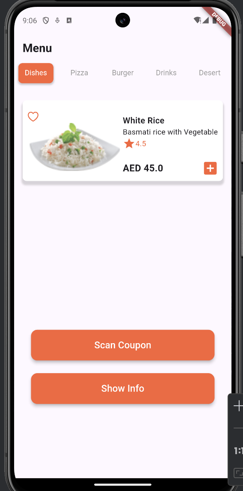
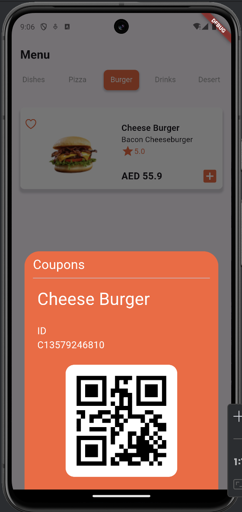
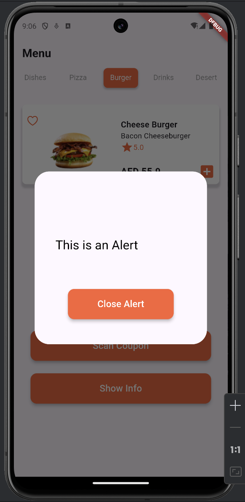

# Restaurant Menu App

A single view interface that includes a Tab bar for selecting food categories and showing corresponding content.
The app also includes 2 buttons at the bottom for displaying a bottom sheet view, and an alert view.

## App Screens

## Created By

- **Amer Alyusuf**
- [Personal Website](https://amer266030.github.io)
- [LinkedIn](https://www.linkedin.com/in/amer-alyusuf-77398587)