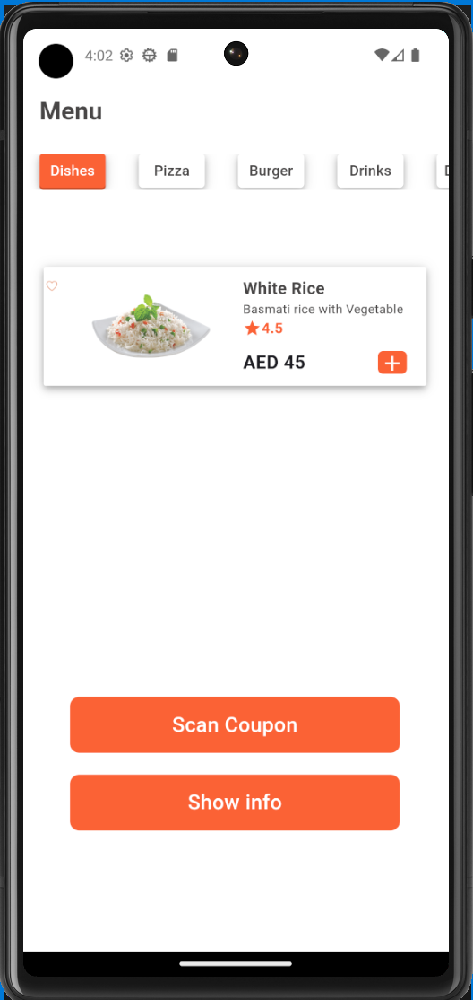
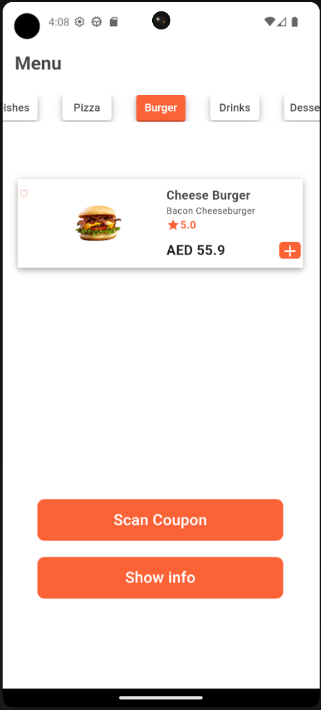
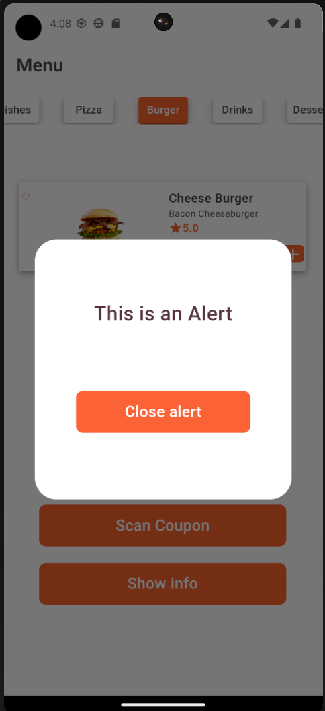
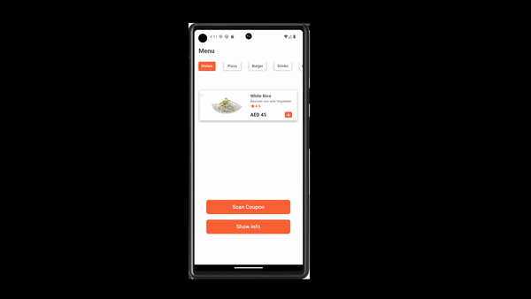

# Restaurant Menu App

A Flutter application with awesome UI to represent a Restaurant Menu

## Main Screen
Contain 5 tabs to allow customer to discover the menu based on food types

## Main Widget

### `TabBar` & `TabBarView`

### `showDialog` & `AlertDialog`

### `showModalBottomSheet`

### `DefaultTabController`

## Output

Feel free to use with account name mentioned

by `Basel-75` Github